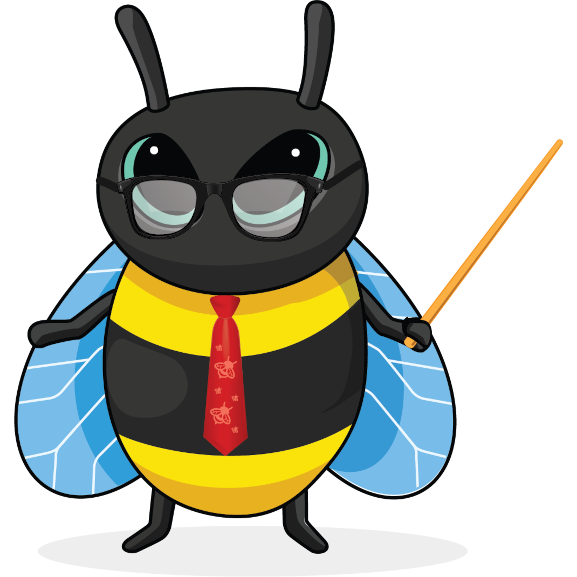
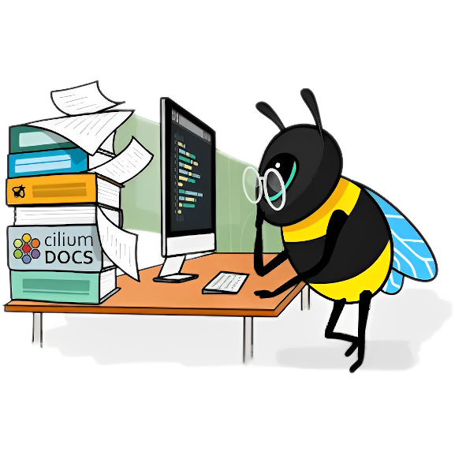

#  eBeeDex

This eBeeDex lists all known eBees and their back story. If you find any more in the wild, please feel free to open a pull request so we have the most up to date information on the species.

<table>
  <tr>
   <td> 
   </td>
   <td> #1: Tetragon eBee
      
      
       Tetragon eBee is from the genus Tetragonula which is a kind of stingless bee. Tetragonula protect their hive in a collective effort, but without a stinger, Tetragon eBee took up his sword and shield. He spends his days observing the kernel and defending it from malicious actors.
   </td>
  </tr>
  <tr>
   <td> 
   </td>
   <td>#2: Jedi eBee (Obee-Wan Kenobee)
      
      
       Obee-Wan Kenobee ranges across the galaxy defending colonies from moths, birds, ants, mites, mice, bears, and other malicious actors. Obee-Wan uses the Force to sense things happening in the kernel and his lightsaber for aggressive negotiations when a process gets out of line. Obee-Wan also taught Tetragon eBee everything he knows. 
   </td>
  </tr>
  <tr>
   <td> 
   </td>
   <td>#3: Skiing eBee
      
      
       While many bees hibernate for winter, Skiing eBee loves to go where no bee has gone before. Growing up in the verdant vallies of Diavolezza, she always wondered what the Swiss people did when she was sleeping. Curiosity eventually got the better of Skiing eBee and she awoke to find a white winter wonderland. She strapped on a pair of skis and quickly progressed from the bunny hill to double blacks and hasn't looked back since.
   </td>
  </tr>
  <tr>
   <td> 
   </td>
   <td>#4: Electrician eBee
      
      
       Pulses and signals are the daily lot for Electrician eBee. There's no wire, no circuit that she cannot tame. Of course, it helps when you're a creature sensitive to electromagnetic fields. Electrician eBee does her best to connect all parts of complex systems and makes it all work flawlessly. She won't hesitate to hook eBPF programs to electrical sockets if she has to. Or to report any misbehaving frequency... Wait! Could Electrician eBee be an undercover Secret Agent from the Hive?
   </td>
  </tr>
  <tr>
   <td> 
   </td>
   <td>#5: Security eBee
      
      
       Security eBee is committed to ensure the well-being of all his community. He brings law, order, but also assistance and kindness to every bee in the Hive. He's often seen hard at work with his “STOP” sign, monitoring the traffic between honeycombs. Security eBee will sometimes be involved in investigations, but will defer complex cases to his friend, Detective eBee.
   </td>
  </tr>
  <tr>
   <td> 
   </td>
   <td>#6: Detective eBee
      
      
       Another mystery to solve? This is a job for Detective eBee! He has an eye for details, and always keeps it open. Ever since his honey jar was stolen as a child, he's been tracking (and catching!) offenders. There's no bug better at finding clues, be it on the crime scene or deep in flow logs. One day he'll have Badger O'Flake, his sworn enemy, locked up for good. Will he need his all-powerful eBPF tools for that? Elementary, my dear eBee!
   </td>
  </tr>
  <tr>
   <td> 
   </td>
   <td>#7: Beekeeper eBee
      
      
       Beekeeper eBee enjoys her life! She loves going outdoors for hiking, cycling, climbing, or staying comfortably home with a book and a warm cup of tea. Alas, this leaves her little time to gather pollen. But she gets help from her cousins, smaller honeybees, of whom she loves taking care. Ensuring every worker in the hive is healthy and happy brings her joy... And honey!
   </td>
  </tr>
  <tr>
   <td> 
   </td>
   <td>#8: Astronaut eBee
      
      
       The Astronaut eBee was chosen among her hive for her deep technical skills, her precision at piloting, and her thirst for adventure. She travels through space to establish relationships with other intelligent species, promoting peaceful and mutually beneficial cooperation. She loves meeting youngsters and encourages them into becoming astronauts.
   </td>
  </tr>
  <tr>
   <td> 
   </td>
   <td>#9: Webinar eBee
      
      
       Keeping up on the latest buzz in the community is no problem for Webinar eBee. Whether it be learning about faster networking, deeper observabiliy, or new security systems to keep honey safe from bears, there is always a new webinar to catch. It's not all just binging content though, Webinar eBee has been known to create some amazing Star Wars themed demos to inspire the next generation of eBees.
   </td>
  </tr>
  <tr>
   <td> 
   </td>
   <td>#10: Teacher eBee
      
      
       eBPF is a rapidly developing technology and there is so much to learn! Never fear, Teacher eBee is here to help. From documentation to tutorials and labs, Teacher eBee is always coming out with new ways to educate and entertain the hive. NewBee eBee is often close to Teacher eBee to cross pollinate some learnings, but Teacher eBee is also known to create courses where even Daniel and Alexei can learn things.
   </td>
  </tr>
  <tr>
   <td> 
   </td>
   <td>#11: Travel eBee
      
      
       Bees usually stick close to their hive, but after seeing all of the possibiles eBPF unlocks for the kernel, Travel eBee knew there was so much more to experience in the world. Working in open source, Travel eBee has also made friends all around the world and is always up for a chance to meet them in person for a beer or some nectar. Travel eBee has been to six continents so far and is just waiting for the invite from Tux to visit the seventh.
   </td>
  </tr>
  <tr>
   <td> 
   </td>
   <td>#12: Santa eBee
      
      
       Originally from the southern hemisphere, Santa eBee enjoys frolicking through the summer flower meadows during the Christmas holiday season and giving small gifts to the rest of the hive to mark the festive holiday season at the end of the calendar year. While the northern bees are hunkered down for winter, Santa eBee meets with them virtually to give them a reminder of the summer days ahead.
   </td>
  </tr>
  <tr>
   <td> 
   </td>
   <td>#13: Kind eBee
      
      
       Every bee working in the hive needs to be reminded sometimes to take time for themselves. Kind eBee is there to support the other bees in the hive by watching out for their emotional and mental well-being. She likes helping the rest of the hive find the right work-life balance and healthy life habits. She's also happy to provide a caring hug when its needed.
   </td>
  </tr>
  <tr>
   <td> 
   </td>
   <td>#14: Public Speaker eBee
      
      
       The Public Speaker eBee loves to answer questions from the community. Whether it's in an AMA session, or quick Q&A after a conference talk, Public Speaker eBee enjoys a good thought-provoking question about eBPF-based projects. Public Speaker eBee is always eager to lend their microphone and help others be heard in the discussion.
   </td>
  </tr>
  <tr>
   <td> 
   </td>
   <td>#15: excelBPF™ eBee
      
      
       excelBPF™ eBee is a technology futurist, expert Excel user, and a bit of a practical joker who plays light-hearted <a href="https://ebpf.io/blog/launching-excel-bpf">April Fool's Day jokes</a> on people.  She's super excited about the promise of <a href="https://github.com/microsoft/ebpf-for-windows">eBPF for Windows</a> and wants to help the community think about what an eBPF empowered Windows experience would look like. Having fun by playing a joke with her Excel VBA skills is also in the books.
   </td>
  </tr>
  <tr>
   <td> 
   </td>
   <td>#16: Celebration eBee
      
      
       Celebration eBee loves a good party! Whether it's birthdays, graduations, anniversaries, or a software release,  Celebration eBee is ready to celebrate each and every accomplishment and milestone happening in the hive.  
   </td>
  </tr>
  <tr>
   <td> 
   </td>
   <td>#17: Easter Egg eBee
      
      
       Easter Egg Ebee loves puzzles and hiding things.  She'll loves leaving little clues inside some of the instructional labs and other learning materials, clues to help solve cute puzzles she's come up with. Or sometimes she just leaves cute little easter eggs she'll hope you find just to make you smile. 
   </td>
  </tr>
  <tr>
   <td> 
   </td>
   <td>#18: 8-bit CTF eBee
      
      
       We all love a good game of Capture the Flag, and 8-bit CTF eBee is no exception. 8-bit CTF eBee loves learning new technical tricks by watching how other people solve the same challenge. She also loves giving people hints when they get stuck, because what she loves best of all is watching people stretch themselves to achieve a new goal. You can find 8-bit CTF eBee hanging out with Congratulations eBee, they're best buds. 
   </td>
  </tr>
  <tr>
   <td> 
   </td>
   <td>#19: NewBee eBee
      
      
       Everyone please give a warm welcome to newBee eBee.  NewBee is new to the community and the number of questions they have is only surpassed by their enthusiasm to learn. NewBee hasn't quite figured out what role they want to play in the Hive yet, so they'll be buzzing around the different teams meeting the other bees and learning from them.   
   </td>
  </tr>
  <tr>
   <td> 
   </td>
   <td>#20: DEI Force eBee
      
      
       As a youngling, this eBee quickly realised he had something different from the others. It troubled him deeply as he grew up. But he held on and grew excellent at gymnastics. Attending a competition one day, he had a sudden revelation: he noticed that winners in every inter-hive competition - sports, engineering, space exploration challenges, and more - were always coming from hives or teams with the most diversity. His difference was a chance, after all! With the assistance of Jedi eBee, he turned his physical abilities towards fencing, to fight oppressors and become a champion of Diversity, Equity, and Inclusion, a spark of light and hope for minorities and unique individuals. At last, DEI Force eBee became a trustful member of the Jedi... and even started to fight to reduce the inequities inside of the Order!
   </td>
  </tr>
  <tr>
   <td> 
   </td>
   </td>
   <td>#21: Caribbean eBee
      
      
       What do you need a backstory for when you're resting on a hamoc under a gentle breeze, on the warm and sunny beaches of a Caribbean island? There's no place like the seashore to meet with friends and discuss new networking designs (Oh wait, I'm hearing that Skiing eBee disagrees with this statement). Caribbean eBee invites you for some fun and relaxation. Take a seat next to her. Sip your honey-rum-coconut juice. Listen to the lulling sound of the waves. Enjoy.
   </td>
  <tr>
   <td> 
   </td>
   </td>
   <td>#22: Holiday eBee
      
      
       The holidays are a time to come together and celebrate everything that has happened in the last year and Holiday eBee takes this task seriously. From decking the halls to exchanging red envelopes to cooking Latkes, no detail is left unnoticed by Holiday eBee when it comes to making traditions come alive. Holiday eBee is from northern latitudes so really enjoys hanging out with Skiing eBee around the holidays too.
   </td>
  </tr>
  <tr>
   <td> 
   </td>
   </td>
   <td>#23: Audit eBee
      
      
       The hive is always a-buzz with activity, but not all of is always good. Audit eBee is behind the scenes checking to be sure everything is in working order - is that pollen packet going to the right address, should that bee be able to access that honeycomb, and most importantly is there enough honey for the Queen Bee. While not the most visible job, Audit eBee loves ensuring that the hive stays safe and efficient so that others can enjoy the honey of their labor.
   </td>
  </tr>
  <tr>
   <td> 
   </td>
   <td>#24: Bounty Hunter eBee
      
      
       Another former student from Jedi eBee, Bounty Hunter eBee didn't feel like embracing the Code, and preferred to put on his robust Honeysteel armor and his full-featured pack to look for relentless action. He remains a very close friend to Tetragon eBee. What the latter does for justice, the former tends to do for credits, but they often join forces on delicate missions. Together they signal the end of the party to the most villainous processes, flood packets, or other creatures from the Outer Rim. Between two commissions, Bounty Hunter eBee loves visiting baby eBees at the orphanage where he grew up. He tells stories and helps the younglings as much as he can. This is the way!
   </td>
  </tr>
  <tr>
   <td> 
   </td>
   <td>#26: Bulldozer eBee
      
      
      Infrastructure is a constant work in progress. There is always something that needs to be built, replaced, upgraded, or renewed. Luckily, Bulldozer eBee in on the job. You'll often see him out in the field digging trenches for fiber or laying the groundwork for a new Internet exchange point. Once he is finished, Electrician eBee is often right behind him to start up the real wiring. There is also a persistent rumour circulating in the hive that Bulldozer eBee occasionally digs caches to store emergency honey supplies.
   </td>
  </tr>
</table>

We hope you enjoy the eBeeDex! As you can see from the LICENSE file, you're welcome to use these eBees for non-commercial purposes. Please make sure you give attribution to Isovalent, linking either to [this repo](https://github.com/isovalent/ebeedex) or to [isovalent.com](isovalent.com). 
