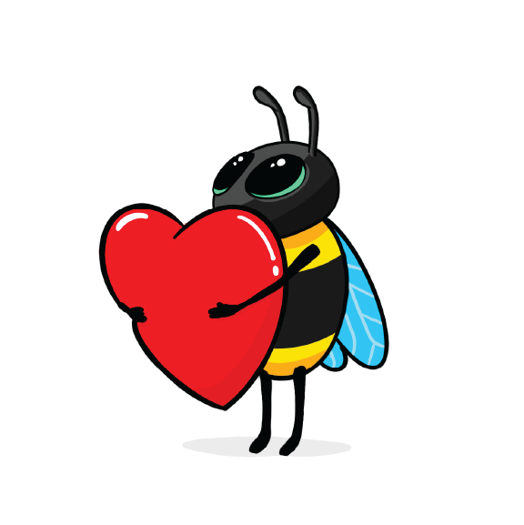
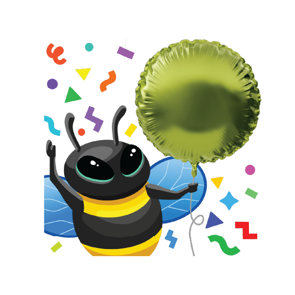

# eBeeDex

This eBee Dex lists all known eBees and their back story. If you find anymore in the wild, please feel free to open a pull request so we have the most up to date information on the species.

<table>
  <tr>
   <td> 
   </td>
   <td> #1: Tetragon eBee
      
      
       Backstory:
       Tetragon eBee is from the genus Tetragonula which is a kind of stingless bee. Tetragonula protect their hive in a collective effort, but without a stinger, Tetragon eBee took up his sword and shield. He spends his days observing the kernel and defending it from malicious actors.
   </td>
  </tr>
  <tr>
   <td> 
   </td>
   <td>#2: Jedi eBee (Obee-Wan Kenobee)
      
      
       Backstory:
       Obee-Wan Kenobee ranges across the galaxy defending colonies from moths, birds, ants, mites, mice, bears, and other malicious actors. Obee-Wan uses the Force to sense things in happening in the kernel and his lightsaber for aggressive negotiations when a process gets out of line. Obee-Wan also taught Tetragon eBee everything he knows. 
   </td>
  </tr>
  <tr>
   <td> 
   </td>
   <td>#3: Skiing eBee
      
      
       Backstory:
       While many bees hibernate for winter, Skiing eBee loves to go where no bee has gone before. Growing up in the verdant vallies of Diavolezza, she always wondered what the Swiss people did when she was sleeping. Curiosity eventually got the better of Skiing eBee and she awoke to find a white winter wonderland. She strapped on a pair of skis and quickly progressed from the bunny hill to double blacks and hasn't looked back since.
   </td>
  </tr>
  <tr>
   <td> 
   </td>
   <td>#4: Electrician eBee
      
      
       Backstory:
       Pulses and signals are the daily lot for Electrician eBee. There's no wire, no circuit that she cannot tame. Of course, it helps when you're a creature sensitive to electromagnetic fields. Electrician eBee does her best to connect all parts of complex systems and makes it all work flawlessly. She won't hesitate to hook eBPF programs to electrical sockets if she has to. Or to report any misbehaving frequency... Wait! Could Electrician eBee be an undercover Secret Agent from the Hive?
   </td>
  </tr>
  <tr>
   <td> 
   </td>
   <td>#5: Security eBee
      
      
       Backstory:
       Security eBee is committed to ensure the well-being of all his community. He brings law, order, but also assistance and kindness to every bee in the Hive. He's often seen hard at work with his “STOP” sign, monitoring the traffic between honeycombs. Security eBee will sometimes be involved in investigations, but will defer complex cases to his friend, Detective eBee.
   </td>
  </tr>
  <tr>
   <td> 
   </td>
   <td>#6: Detective eBee
      
      
       Backstory:
       Another mystery to solve? This is a job for Detective eBee! He has an eye for details, and always keeps it open. Ever since his honey jar was stolen as a child, he's been tracking (and catching!) offenders. There's no bug better at finding clues, be it on the crime scene or deep in flow logs. One day he'll have Badger O'Flake, his sworn enemy, locked up for good. Will he need his all-powerful eBPF tools for that? Elementary, my dear eBee!
   </td>
  </tr>
  <tr>
   <td> 
   </td>
   <td>#7: Beekeeper eBee
      
      
       Backstory:
       Beekeeper eBee enjoys her life! She loves going outdoors for hiking, cycling, climbing, or staying comfortably home with a book and a warm cup of tea. Alas, this leaves her little time to gather pollen. But she gets help from her cousins, smaller honeybees, of whom she loves taking care. Ensuring every worker in the hive is healthy and happy brings her joy... And honey!
   </td>
  </tr>
  <tr>
   <td> 
   </td>
   <td>#8: Astronaut eBee
      
      
       Backstory:
       The Astronaut eBee was chosen among her hive for her deep technical skills, her precision at piloting, and her thirst for adventure. She travels through space to establish relationships with other intelligent species, promoting peaceful and mutually beneficial cooperation. She loves meeting youngsters and encourages them into becoming astronauts.
   </td>
  </tr>
  <tr>
   <td> 
   </td>
   <td>#9: Webinar eBee
      
      
       Backstory:
       Keeping up on the latest buzz in the community is no problem for Webinar eBee. Whether it be learning about faster networking, deeper observabiliy, or new security systems to keep honey safe from bears, there is always a new webinar to catch. It's not all just binging content though, Webinar eBee has been known to create some amazing Star Wars themed demos to inspire the next generation of eBees.
   </td>
  </tr>
  <tr>
   <td> 
   </td>
   <td>#10: Teacher eBee
      
      
       Backstory:
   </td>
  </tr>
  <tr>
   <td> 
   </td>
   <td>#11: Travel eBee
      
      
       Backstory:
   </td>
  </tr>
  <tr>
   <td> 
   </td>
   <td>#12: Santa eBee
      
      
       Backstory:
       Originally from the southern hemisphere, Santa eBee enjoys frolicking through the summer flower meadows during the Christmas holiday season and giving small gifts to the rest of the hive to mark the festive holiday season at the end of the calendar year. While the northern bees are hunkered down for winter, Santa eBee meets with them virtually to give them a reminder of the summer days ahead.
   </td>
  </tr>
  <tr>
   <td> 
   </td>
   <td>#13: Kind eBee
      
      
       Backstory:
       Every bee working in the hive needs to be reminded sometimes to take time for themselves. Kind eBee is there to support the other bees in the hive by watching out for their emotional and mental well-being. She likes helping the rest of the hive find the right work-life balance and healthy life habits. She's also happy to provide a caring hug when its needed.
   </td>
  </tr>
  <tr>
   <td> 
   </td>
   <td>#14: Public Speaker eBee
      
      
       Backstory:
       The Public Speaker eBee loves to answer questions from the community. Whether it's in an AMA session, or quick Q&A after a conference talk, Public Speaker eBee enjoys a good thought-provoking question about eBPF-based projects. Public Speaker eBee is always eager to lend their microphone and help others be heard in the discussion.
   </td>
  </tr>
  <tr>
   <td> 
   </td>
   <td>#15: excelBPF™ eBee
      
      
       Backstory:
       excelBPF™ eBee is a technology futurist, expert Excel user, and a bit of a practical joker who plays light-hearted [April Fool's Day jokes](https://ebpf.io/blog/launching-excel-bpf/) on people.  She's super excited about the promise of [eBPF for Windows](https://github.com/microsoft/ebpf-for-windows) and wants to help the community think about what an eBPF empowered Windows experience would look like. Having fun by playing a joke with her Excel VBA skills is also in the books. 
   </td>
  </tr>
  <tr>
   <td> 
   </td>
   <td>#16: Celebration eBee
      
      
       Backstory:
       Celebration eBee loves a good party! Whether it's birthdays, graduations, anniversaries, or a software release,  Celebration eBee is ready to celebrate each and every accomplishment and milestone happening in the hive.  
   </td>
  </tr>
  <tr>
   <td> 
   </td>
   <td>#17: Easter Egg eBee
      
      
       Backstory:
       Easter Egg Ebee loves puzzles and hiding things.  She'll loves leaving little clues inside some of the instructional labs and other learning materials, clues to help solve cute puzzles she's come up with. Or sometimes she just leaves cute little easter eggs she'll hope you find just to make you smile. 
   </td>
  </tr>
  <tr>
   <td> 
   </td>
   <td>#18: 8-bit CTF eBee
      
      
       Backstory:
       We all love a good game of Capture the Flag, and 8-bit CTF eBee is no exception. 8-bit CTF eBee loves learning new technical tricks by watching how other people solve the same challenge. She also loves giving people hints when they get stuck, because what she loves best of all is watching people stretch themselves to achieve a new goal. You can find 8-bit CTF eBee hanging out with Congratulations eBee, they're best buds. 
   </td>
  </tr>
</table>

We hope you enjoy the eBeeDex! As you can see from the LICENSE file, you're welcome to use these eBees for non-commercial purposes. Please make sure you give attribution to Isovalent, linking either to [this repo](https://github.com/isovalent/ebeedex) or to [isovalent.com](isovalent.com). 
